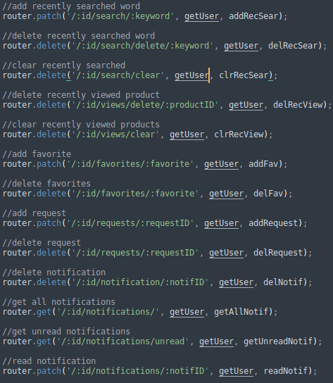

# displayAPI
### where buyers and sellers come together
### Introduction

The displayAPI is a RESTful API for an expo company, It comes populated from the uptake with many products, users, sellers.

### Objective

primarily used to exhibit products on a 24-hour basis,
the displayAPI provides the abiltiy for users to create an account with one of three roles: (user/sellers/admin)
- a user has a profile page which contains information like: 
  - his personnel information
  - a favorite list of products
  - a history of all his browsed products
  - a list of the sellers he's following
  - a history of his requested products
  
- a seller also owns a profile page that contains:
  - his personnel information
  - a list of the products he created
  - a list of the requests users made for his products
- a seller can also opt for a paid plan that will give him more features like:
  - bonus amount of products he can add
  - bonus amount of edits he can operate on his products
- a seller is able to contact users that requested his products using the messaging app

- an admin mainly uses a dashboard to moderate the website:
  - list of all users/sellers
  - moderate flagged messages on the messaging app
  - capable of banning or even deleting accounts based on the wesbite rules

### Backend

- Built with Nodejs and Express
- all sensitive/private endpoints were protected with JWT (JSON Web Tokens).

#### Sections

- Authentication
- Admins
- Sellers
- Products
- Users

#### Requirements

- NodeJS v16.14.2
- Express v4.18.1
- Mongoose v6.5.1
- stream-chat v7.1.0

#### Routes

##### Admin:

| HTTP method  | Route  | Description |
| :------------ |:--------------- | :---------------- |
| POST      | /admin | create an admin (JWT Protected) |
| GET      | /admin/:id/logs | admin notifications (JWT Protected) |
| DELETE      | /admin/:id/clr/logs | delete admin notifications (JWT Protected) |

##### Authentication:

| HTTP method  | Route  | Description |
| :------------ |:--------------- | :---------------- |
| POST      | /auth/signupSeller | seller signup |
| POST      | /auth/signup | user signup |
| POST      | /auth/login | login |
| PATCH      | /auth/editlogin | edit user/seller info |
| DELETE      | /auth/eraseUser/:id | delete a user |

##### Product:

| HTTP method  | Route  | Description |
| :------------ |:--------------- | :---------------- |
| GET      | /products | products list |
| GET      | /products/page/:number | products list by page |
| GET      | /products/:id | product by ID |
| GET      | /products/title/:title | product by title |
| GET      | /products/title/:title/category/:category | product by title and category |
| GET      | /products/seller/:seller/category/:category | product by seller and category |
| GET      | /products/seller/:sellerName | products by seller |
| GET      | /products/category/:category | products by category |
| GET      | /products/sellers/category/:category | seller's products by category |
| GET      | /products/user/requests | products user requests |
| PATCH      | /products/:id | product update (JWT Protected) |
| PATCH      | /products/:id/requests | add product request |
| DELETE      | /products/:id/requests/:requestID | delete a product's requests |
| DELETE      | /products/:id | delete a product (JWT Protected) |
| POST      | /products | add a product (JWT Protected) |

##### Seller:

| HTTP method  | Route  | Description |
| :------------ |:--------------- | :---------------- |
| GET      | /sellers | sellers list |
| GET      | /sellers/page/:number | sellers list by page |
| GET      | /sellers/:id | seller by ID |
| GET      | /sellers/name/:name | seller by name |
| GET      | /sellers/:id/notifications | seller's notifications |
| GET      | /sellers/:id/notifications/unread | seller's unread notifications |
| GET      | /sellers/:name/followers | seller's followers list |
| PATCH      | /sellers/:id/notifications/:notifID | read a seller's notification |
| PATCH      | /sellers/:name/upgrade/:plan | upgrade a seller's plan |
| DELETE      | /sellers/:id/notification/:notifID | delete a seller's notification |
| DELETE      | /sellers/:id/clr/notification | delete a seller's notification list |

##### User:

| HTTP method  | Route  | Description |
| :------------ |:--------------- | :---------------- |
| GET      | /users | users list |
| GET      | /users/page/:number | users list by page |
| GET      | /users/:id/ | user by ID |
| GET      | /users/:id/notifications | user's notifications |
| GET      | /users/:id/notifications/unread | user's unread notifications |
| GET      | /users/:id/following | user's following list |
| PATCH      | /users/:id/search/:keyword | add a user's recently searched word |
| PATCH      | /users/:id/favorites/:favorite | add a user's favorite product |
| PATCH      | /users/:id/requests/:requestID | add a user's request |
| PATCH      | /users/:id/notifications/:notifID | read a user's notification |
| PATCH      | /users/:id/follow/:sellerName | add a user's follow |
| DELETE      | /users/:id/search/delete/:keyword | delete user's recently searched word |
| DELETE      | /users/:id/search/clear | delete a user's recently searched list |
| DELETE      | /users/:id/views/delete/:productID | delete a user's recently viewed product |
| DELETE      | /users/:id/views/clear | delete a user's recently viewed products list |
| DELETE      | /users/:id/favorites/:favorite | delete a user's favorite product |
| DELETE      | /users/:id/requests/:requestID | delete a user's request |
| DELETE      | /users/:id/notification/:notifID | delete a user's notification |
| DELETE      | /users/:id/clr/notification | delete a user's notification list |
| DELETE      | /users/:id/follow/:sellerName | delete a user's follow |
| DELETE      | /users/:id/clr/follow | delete a user's follow list |

##### Routes samples:

###### Product:

###### User:
